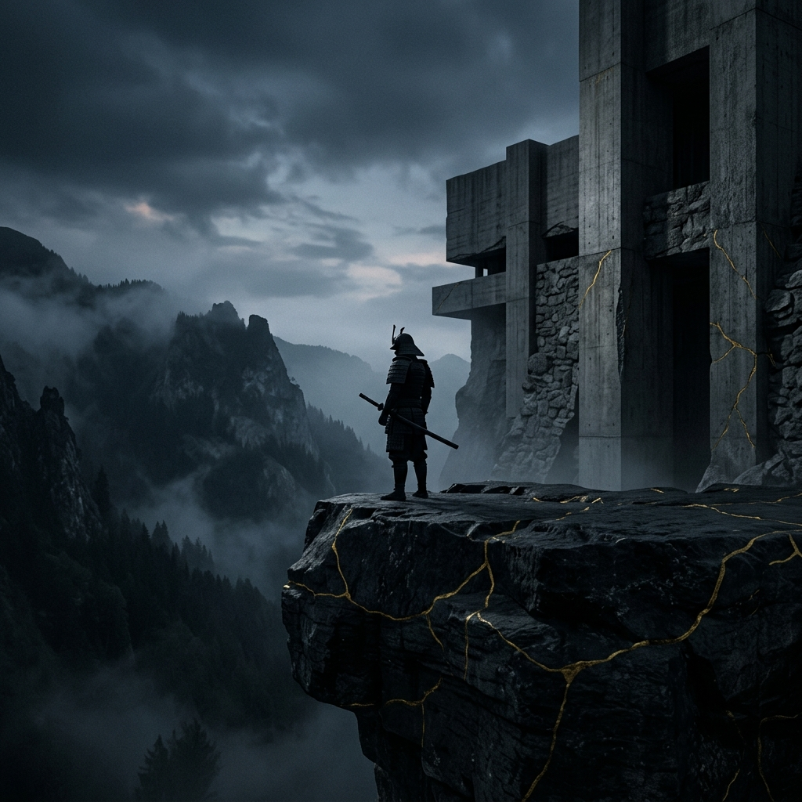

# Sessiz Direnç: Zihinsel Egemenlik ve Stoacı Felsefe Manifestosu 🏛️

> *"Kendine tahammül edemeyen bir zihin, dünyadaki hiçbir sığınağa sığamaz. Gerçek özgürlük, insanın kendi içindeki o aşılamaz kaleyi inşa etmesiyle başlar."* — **Seneca**

Hoş geldin yolcu. 

Bu sayfa, sıradan bir okuma listesi, popüler bir kişisel gelişim zırvası veya geçici bir motivasyon kaynağı değildir. Burası, dış dünyanın dinmek bilmeyen fırtınalarına, düzenin anlık sarsıntılarına, insan doğasının hayal kırıklıklarına ve hayatın kaçınılmaz trajedilerine karşı inşa edilmiş **sarsılmaz bir iç kalenin mimari planlarıdır.** 

İnsanlık tarihi kadar eski olan acı, belirsizlik, ihanet ve kaos karşısında; insanın zihinsel bütünlüğünü nasıl koruyabileceğine dair kadim bir yaşam kılavuzudur. **Sessiz Direnç**, Stoacı felsefeyi tozlu raflardaki bir dogma olarak değil, modern çağın gürültüsünde hayatta kalmak ve kendi zihnine hükmetmek için temel bir yaşam disiplini olarak sunar.

---

## 🏛️ Külliyat Yapısı (Navigasyon)

Bu arşiv, teoriden pratiğe, kadim köklerden modern mitlere kadar geniş bir spektrumda yapılandırılmıştır. Her bir başlık, iç kalenin farklı bir savunma hattını temsil eder:

1.  **[📜 Nazariyat (Teorik Çerçeve)](nazariyat/)**: Zihinsel egemenliğin ontolojik temelleri.
2.  **[⚔️ Amelyat (Pratik Cephanelik)](amelyat/)**: Felsefeyi eyleme dönüştüren günlük egzersizler.
3.  **[🐉 Modern Mitler](modern_mitler/)**: Kadim ilkelerin Samuray Jack gibi modern anlatılardaki yansımaları.
4.  **[🏺 Kökler (Büyük Üstadlar)](kokler/)**: Seneca, Epiktetos ve Marcus Aurelius'un mirası.

---

## I. Evrenin İşleyişi: Sükunetin ve Kaosun Anatomisi

Stoacılık (M.Ö. 300 dolaylarında Kıbrıslı Zenon tarafından Atina'nın boyalı sundurmalarında kurulan öğreti), modern çağın yanlış yorumladığı gibi "duyguları bastırmak", "robotlaşmak" veya "taştan bir duvar olmak" değildir. 

Aksine, bu felsefe; duyguların kökenindeki hatalı inançları anlamak, yıkıcı ihtirasları (öfke, kıskançlık, keder, kibir) kaynağında ehlileştirmek ve en büyük fırtınaların ortasında rasyonel bir sükunetle durabilme sanatıdır. Stoacılar evrenin kusursuz bir nedensellik bağına (*Logos*) sahip olduğuna inanır. 

Bizler bu devasa zincirin içinde sadece birer halkayız. Başımıza gelenleri, doğduğumuz yeri, başkalarının eylemlerini her zaman seçemeyiz. Ancak dışarıdan gelen bu etkiyi nasıl karşılayacağımız, o rolü ne kadar asil, ne kadar onurlu ve dik bir duruşla oynayacağımız **tamamen ve mutlak surette bizim elimizdedir.**

---

## II. Sükunetin Temeli: Kontrol Dikotomisi (En Yüce Yasa)

Stoacı mimarinin taşıyıcı kolonu ve en güçlü savunma hattı **Kontrol Dikotomisi**'dir. Topal bir köle olarak doğup Roma İmparatoru'na hocalık yapacak kadar yükselen sarsılmaz bilge Epiktetos, özgürlüğün sırrını tek ve acımasız bir ayrımda bulmuştur:

> *"Dünyadaki şeyler ikiye ayrılır: Bizim kontrolümüzde olanlar ve bizim kontrolümüzde olmayanlar."*

### 1. Mutlak Egemenlik Alanımız (İç Kale)
Düşüncelerimiz, inançlarımız, hedeflerimiz, olaylara verdiğimiz tepkiler ve irademiz. Burası senin fethedilemez kalendir. Dışarıdan olaylar (hakaret, övgü, felaket, başarı) kapına dayanır, ancak o olayların seni nasıl etkileyeceğine sadece içerideki irade karar verir. Sen onay vermedikçe (yargını katmadıkça) kimse zihnine sızamaz. Epiktetos'un dediği gibi: *"Bana zarar verdiğini düşünmezsem, zarar görmem."*

### 2. İllüzyon Alanı (Dış Dünya)
Bedenimizin sağlığı, piyasalar, makamlar, diğer insanların bizim hakkımızdaki düşünceleri, geçmişteki hatalar, gelecek kaygıları ve şöhret. Bunların hiçbiri bizim doğrudan kontrolümüzde değildir. Sadece çabalayabiliriz, ancak nihai sonucu dikte edemeyiz.

**Okçu Metaforu:** Bir okçu, yayını gerebilir, nefesini tutabilir, rüzgarı hesaplayabilir ve nişan alabilir. Bunlar onun iradesindedir. Ancak ok yaydan çıktığı an, hedefe ulaşıp ulaşmayacağı artık onun elinde değildir; ani bir rüzgar çıkabilir, hedef hareket edebilir. Okçu, oku vuramamaktan değil, **kendi üzerine düşeni en mükemmel şekilde yapmamaktan** utanç duymalıdır. Sonuca değil, duruşuna odaklan.

---

## III. İç Kalenin Dört Ana Sütunu: Temel Erdemler

Bir Stoacı'nın yaşam gayesi dışsal onay, zenginlik veya bedensel haz değil, **Erdem**'dir (*Arete*). Zihnin mükemmelliği şu dört ana sütun üzerine inşa edilir:

1.  **Pratik Bilgelik (*Phronesis*):** Gerçeği yanılsamadan ayırma yetisidir. Neyin kontrol edilebilir, neyin edilemez olduğunu anında ayırt etmektir. Olayları toplumsal illüzyonlardan, süslü etiketlerden arındırarak, en yalın, objektif ve acımasız haliyle görebilme cesaretidir. Pahalı bir şarabı "fermente olmuş üzüm suyu", lüks bir cübbeyi "koyun yünü ve böcek kanı" olarak görebilmektir.
2.  **Cesaret (*Andreia*):** Sadece kılıç kuşanmak değil; belirsizliğe yürümeye, doğru olanı söylemeye, reddedilmeyi göze almaya, yalnız kalabilmeye ve en önemlisi **acıya rağmen ilerlemeye** duyulan ruhsal dayanıklılıktır. Acı çekmek bir zayıflık değil, iradenin sınandığının kanıtıdır.
3.  **Adalet (*Dikaiosyne*):** Bireyin içinde bulunduğu büyük düzene karşı sorumluluğudur. Yalnızca hukuki değil; dürüst, merhametli ve rasyonel olma halidir. İmparator Marcus Aurelius'un dediği gibi: *"Arı kovanına faydası olmayan şeyin, arıya da faydası yoktur."* Kendi çıkarın için bütünü zehirleme.
4.  **Ölçülülük (*Sophrosyne*):** İradenin dizginlenmesidir. İhtirasların, bedensel arzuların ve aşırılıkların kontrol altına alınması. Gücün varken affedebilmek, konuşma hakkın varken susabilmek, intikam alma fırsatın varken "en iyi intikam düşmanın gibi olmamaktır" diyebilmek, imkanın varken yetinebilmektir.

---

## IV. Zihinsel Dayanıklılık Sınavları

Modern dünya zihnin için sürekli bir kuşatmadır. Kışkırtılmış öfke kültürü, dikkat dağıtıcı hazlar ve sahte alkışlar; hepsi senin iç kalene yapılmış birer saldırıdır. 

Bir Stoacı, kendi zihnine düzenli olarak "dayanıklılık sınavları" uygular. Kendi zafiyetlerini, hayat ona acı bir şekilde öğretmeden önce bizzat kendisi bulur ve onarır.
*   **Öfke Sınavı:** Biri sana hakaret ettiğinde anında parlıyor musun? Eğer öyleyse, zihinsel kalkanın düşmüş, o kişinin kölesi olmuşsun demektir. 
*   **Haz Sınavı:** Konforsuzlukla veya en sevdiğin yiyeceklerden uzak kalmakla yüzleştiğinde sükunetini kaybediyor musun? O halde özgür değilsin, arzularının esirisin.

---

## V. Taktiksel Cephanelik: Kadim Pratikler

Bu felsefe pasif bir okuma eylemi değil, amansız bir pratiktir. Zihni eğitmek ve dış dünyanın kuşatmasına karşı koymak için aşağıdaki öğretiler tavizsiz uygulanır:

### 1. Amor Fati (Kaderini Sev)
Olan biten her şeyi sadece "katlanılması gereken" bir yük olarak görme; onları kucakla. Hastalık, dışlanma, emeklerinin boşa gitmesi, ihanet veya adaletsizlik... Bunların hiçbiri felaket değildir; seni sınayan, zafiyetlerini gösteren ve iradeni çelikleştiren birer fırsattır. Rüzgar, küçük bir ateşi söndürür ama büyük bir yangını harlar. **Yakıtı ateş olan her şey daha da büyür. Sen yangın ol.**

### 2. Premeditatio Malorum (Kötülüklerin Önceden Tahlili)
Her sabah uyandığında, gün içinde karşılaşabileceğin en kötü senaryoları zihninde yaşa. Kaba insanlarla, nankörlükle, emeğinin çalınmasıyla, ihanetle karşılaşabileceğini bil. Beklenmedik bir kriz zihni paramparça eder; oysa önceden ölçülüp biçilmiş bir acı, sağlam bir zırha çarpan kör bir ok gibidir. Acıyı gerçekleşmeden önce zihninde göğüsle ki, kapını çaldığında sadece bir teferruat olsun.

### 3. Gönüllü Zorluk (Voluntary Hardship)
Konfor, ruhun zehridir. İradenin rehavete kapılmaması için ara sıra bilinçli olarak konfor alanından çık. Seneca gibi arada sırada en ucuz kıyafetleri giy, sert bir zeminde uyu, soğuk suyla yıkan veya günlerce aç kal. *"Eğer talih bana sırtını dönerse kaybedeceğim şey bu mu?"* diye sor. Kaybetme korkusunu yenmenin tek yolu, o hiçliğin içinde kendi rızanla kamp kurmaktır.

### 4. Kuşbakışı Perspektif (View from Above)
Kibirlendiğinde, sorunlar gözünde büyüdüğünde veya bir haksızlığa öfkelendiğinde, zihnini gökyüzüne yükselt. Şehrini, ülkeni, dünyayı ve uzayın sonsuzluğunu düşün. Milyarlarca yıllık evren tarihinde, senin şu an canını sıkan o dert ne kadar yer kaplıyor? Meseleleri kendi gerçek ölçeklerine küçült. Sen sadece sonsuzlukta bir anlık parlamasın; bu kısacık anı öfkeyle zehirleme.

### 5. Memento Mori (Ölümlü Olduğunu Hatırla)
Zaman, sahip olduğun tek gerçek hazinedir, biriktirilemez ve hızla tükenmektedir. Ölüm karanlık ve korkutucu bir son değil, yaşamın her anına anlam katan, eyleme geçmeni emreden yegane gerçektir. Bugün, bu satırları okuduğun son gün olabilir. Öyleyse neden saniyelerini gereksiz insanlara açıklama yaparak, başkalarının ne düşündüğünü umursayarak veya potansiyelini gerçekleştirmeyi erteleyerek israf ediyorsun?

---

## VI. Modern Bir Mit: Samurayın Yolu ve Somutlaşmış Direnç

Stoacı felsefenin sadece antik Roma arenasında kalmadığının, zamanın ve mekanın ötesinde evrensel bir ruh hali olduğunun en saf kanıtlarından biri, modern bir destan olan **Samuray Jack**'in yolculuğudur. O sadece bir çizgi karakter değil, acı çeken, kaybeden ama yürümekten asla vazgeçmeyen bir iradenin manifestosudur.

*   **Mutlak Kabulleniş (Amor Fati):** Jack, şeytani figür Aku (kaos, kötülük ve kontrol edilemeyen dış faktörler) tarafından sevdiklerinden, evinden ve kendi zamanından koparılıp yabancı, düşmanca ve kurallarını bilmediği bir geleceğe fırlatılır. Geçmişini kaybetmiştir. Dünyası yıkılmıştır. Ancak o, oturup "Neden ben?" diye ağlamaz. İçinde bulunduğu distopik gerçekliği kabullenir ve sadece önündeki adımı nasıl atacağına odaklanır.
*   **Erdem İçin Hedefi Feda Etmek:** Jack'in tek bir amacı vardır: Geçmişe dönmek. Ancak sayısız kez, tam zaman portalına ulaşacakken, yoluna çıkan yardıma muhtaç masumları kurtarmak için kendi nihai hedefinden vazgecer. Çünkü Stoacı için yegane iyi, sadece hedefe ulaşmak değil; o yolda adaletten, merhametten ve erdemden sapmamaktır. O portala onursuzca girmektense, adaleti sağlayıp ıstırap dolu o gelecekte hapis kalmayı seçer.
*   **Zihinsel Çöküş ve Diriliş:** On yıllar boyunca yürümesine, hiçbir yaşlanma belirtisi göstermemesine rağmen ruhu yara alır. Kılıcını (amacını ve ruhsal dengesini) kaybeder. Uçurumun kenarındaki, kendi içindeki karanlık gölgelerle boğuşur. Ancak dışarıdaki kaos ne kadar büyük olursa olsun, eninde sonunda içsel sükunetini yeniden bulur. Çöllerden, karlı dağlardan ve yalnızlıktan geçer. Şikayet etmez. Sadece katlanır ve yürür. O, Kontrol Dikotomisi'nin vücut bulmuş halidir; dış dünyayı kontrol edemez ama kendi onurunu, kılıcını ne için çekeceğini mutlak surette o belirler.

---

## VII. İnziva ve Sessiz Seyyahın Sığınağı

Büyük eserler, derin düşünceler ve yıkılmaz karakterler kalabalıkların sahte alkışlarında değil, mutlak bir sessizliğin ve izolasyonun içinde dövülür. 

Bazen her şeyden soyutlanıp, dış dünyanın onayından ve yüzeysel ilişkilerden uzaklaşmak; derin bir inziva evresine girmek şarttır. Yabancı bir şehrin sessiz bir köşesinde, tanımadığın insanların arasında tek başına bir amaca gömüldüğünde, kendi zihninin sesinden başka duyacağın hiçbir şey kalmadığında gerçek inşaan başlar. Bir seyyahın tek kalıcı yurdu, kendi kafasının içidir. Coğrafyalar değişir, insanlar gelir ve geçer; ancak senin merkezin her zaman kendi içinde sükunet üretmeye devam etmelidir.

---

## VIII. Zihnin Gözetimi: Özdenetim Rutinleri

Günü tesadüflere ve anlık dürtülere bırakmak, iradeye ihanettir. Zihnin güne başlama ve günü bitirme ritüelleri eksiksiz uygulanmalıdır:

*   **Sabah Başlangıcı (Niyet Kurulumu):** Güne başlarken *Prosochē* (Sürekli Dikkat) halini kuşan. *"Bugün karşıma cahiller, engeller, kıskançlar ve krizler çıkacak. Ancak benim iradem, bunlara rasyonel ve erdemli yanıtlar verecek şekilde eğitildi. Onların eylemleri benim iç huzurumu bozamaz."*
*   **Akşam Muhasebesi (Zihinsel Arınma):** Uyumadan önce günün acımasız bir denetimini yap. Kendine yalan söyleme:
    *   *Bugün hangi dürtüme yenik düştüm?*
    *   *Hangi olay karşısında sükunetimi kaybettim, nerede gereksiz konuştum?*
    *   *Yarın bu zafiyeti kapatmak için neyi daha farklı yapacağım?*

---

## IX. Üç Temel Disiplin: Arzu, Eylem ve Onay

Epiktetos tarafından sistemleştirilen bu üç disiplin, Stoacı yaşamın operasyonel iskeletidir:

1.  **Arzu Disiplini (*Discipline of Desire*):** Neyin gerçekten arzulanmaya değer olduğunu ve neyden kaçınmamız gerektiğini belirler. Sadece erdemi arzulayıp, irademiz dışındaki her şeye karşı "Amor Fati" geliştirmektir.
2.  **Eylem Disiplini (*Discipline of Action*):** Toplumsal rollerimizi (baba, komutan, vatandaş) nasıl en mükemmel şekilde oynayacağımızı belirler. Adalet ve iyilikle hareket etmektir.
3.  **Onay Disiplini (*Discipline of Assent*):** Zihnimize gelen izlenimlere (impressions) hemen inanmamak, onları rasyonel bir süzgeçten geçirmektir. "Bu bir felaket" yargısına onay vermezsen, felaket gerçekleşmemiş olur.

---

## X. Dijital Çağda Sessiz Direniş

Modern dünya, zihnimizi ele geçirmek için tasarlanmış devasa bir algoritmadır. 
*   **Dopamin Döngülerini Kırmak:** Anlık bildirimler ve sonsuz kaydırma, iradeyi felç eder. Telefonunu bir "araç" olarak kullan, onun kölesi olma.
*   **Bilgi Obezitesinden Kaçış:** Her şeyi bilmek zorunda değilsin. Sadece senin karakterini geliştirecek olan bilgilere odaklan.
*   **Sanal Onay Köleliği:** Sosyal medyadaki "beğeniler", Epiktetos'un "başkalarının düşünceleri" kategorisindedir. Onların varlığı seni büyütmez, yokluğu seni küçültmez.

---

## XI. Kavramlar Sözlüğü: Stoacı Terimler

*   **Eudaimonia:** Genelde "mutluluk" diye çevrilse de, aslında "ruhsal bütünlük" ve "gelişmiş bir karakterle yaşam sürmek" demektir.
*   **Ataraxia:** Sarsılmaz bir iç huzur, ruhsal sarsılmazlık hali.
*   **Apatheia:** Duygusuzluk değil, yıkıcı tutkulardan (passions) arınmış olma halidir.
*   **Prohairesis:** Ahlaki karakter ve rasyonel seçim gücü. İnsanın özgürlüğünün tek kaynağı.
*   **Kayıtsızlar (*Indifferents*):** Sağlık, zenginlik, ün gibi şeyler; erdemin yanında nötrdürler. Tercih edilebilir (sağlık) veya edilemez (hastalık) olabilirler ama mutluluğun kaynağı değildirler.

---

## XII. Yol Haritası: 30 Günlük Zihinsel Kamp

1.  **1-7. Gün:** Sadece Kontrol Dikotomisi'ne odaklan. Gün boyu "Bu benim elimde mi?" diye sor.
2.  **8-14. Gün:** Gönüllü Zorluk uygulamaya başla. (Soğuk duş, bir öğün atlama).
3.  **15-21. Gün:** Akşam Muhasebesi rutini oluştur. Kendini dürüstçe yargıla.
4.  **22-30. Gün:** Sessiz İcraat. Bir hafta boyunca hiçbir planını veya başarını kimseye anlatma. Sadece yap.

---

## XIII. Epilog: Acıya Rağmen Yürümek ve Sessiz İcraat

Bu sayfa, sana rahat bir yaşam, zenginlik, başarı veya mutluluk garantisi vermez. Aksine; hayatın son derece acımasız olacağını, kurduğun düzenlerin yıkılacağını, çok güvendiğin yapıların sarsılacağını, en büyük emeklerinin bazen tek bir talihsizlikle veya haksızlıkla yok olacağını garanti eder. Tıpkı zamanın ötesindeki samuray gibi, tüm varlığın elinden alınabilir.

Ancak sana çok daha eşsiz bir şey vaat eder: **Eğer bu prensipleri bir yaşam formuna dönüştürürsen, dışarıda kıyamet kopsa dahi, o inşa ettiğin sessiz, görkemli ve bağımsız kale asla düşmeyecektir.**

*   Şikayet etme. Şikayet etmek kurbanların dilidir.
*   Kimseye bir şey ispatlamaya çalışma. Onay aramak köleliktir.
*   Açıklama yapma. Eylemlerin kendi dilini konuşsun.
*   Mazeret üretme. Gerekçeler zayıflara aittir.

Sadece sessiz kal. İçindeki meşaleyi yak. Yapılması gerekeni, kendi doğana ve erdeme uygun şekilde yap. Dizlerin kanasa da, hedeflerin yıkılsa da, umutların sarsılsa da; kılıcını kaybetmiş ve yolu unutmuş olsan bile, içindeki fırtınayı dindirip **acıya rağmen yürümeye devam et.**

> *"Engel eylemi ilerletir. Yolu tıkayan şey, yolun kendisi olur."* — **Marcus Aurelius**

---
*Bu külliyat, zihinsel özgürlüğünü ilan eden sessiz bir direnişin, bir başkaldırının ve bir inşa sürecinin ürünüdür.*